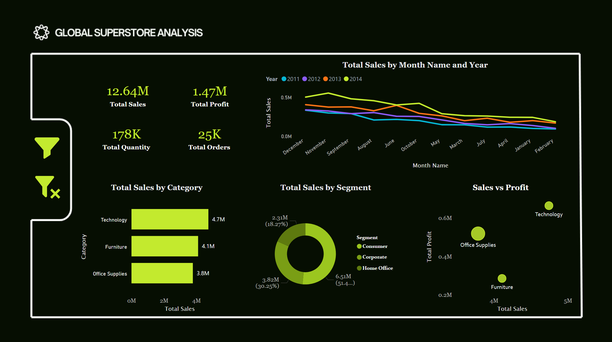

# Global Superstore Sales Analysis | Power BI Dashboard

## Overview
Multi-page Power BI dashboard analysing global retail performance 
across sales, profit, quantity, and orders over 4 years.

## Dashboard Preview

## Key Metrics
- Total Sales: $12.64M
- Total Profit: $1.47M
- Total Quantity: 178K units
- Total Orders: 25K

## Key Insights
- Technology was the top category at $4.7M in sales
- Consumer segment drove 51.4% of total sales ($6.51M)
- Technology showed highest profit margin in Sales vs Profit analysis
- Built year-over-year monthly trend analysis (2011–2014)

## Tools Used
- Microsoft Power BI
- DAX
- Power Query
- Data Visualization
- Business Intelligence
